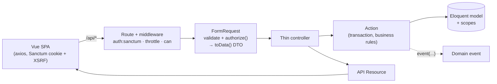
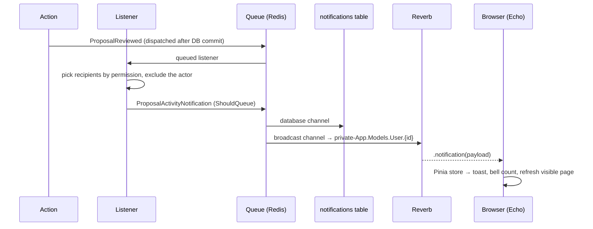

# Podium — talk proposal review

Speakers submit talk proposals, reviewers rate them, admins decide — and everyone involved hears about it live.

**Laravel 12 JSON API + Vue 3 / TypeScript SPA**, Sanctum cookie auth, permission-based authorization, Reverb WebSockets, PostgreSQL, Redis.

| | |
|---|---|
| Backend checks | Pint · Larastan level 8 · **168 Pest tests** (incl. a 56-case authorization matrix) |
| Frontend checks | `vue-tsc` strict · **36 Vitest specs** · production build |
| API docs | OpenAPI 3.1 generated from code at **`/docs/api`** |
| CI | GitHub Actions runs all of the above on every push |

---

## Contents

1. [Quick start (Sail)](#quick-start-sail)
2. [Demo accounts](#demo-accounts)
3. [Features](#features)
4. [Architecture](#architecture)
5. [Security](#security)
6. [Testing](#testing)
7. [API](#api)
8. [Switching search to Meilisearch](#switching-search-to-meilisearch)
9. [Running without Docker](#running-without-docker)
10. [Assumptions](#assumptions)
11. [Trade-offs & what I'd do next](#trade-offs--what-id-do-next)

---

## Quick start (Sail)

Requires Docker. Everything else (PHP 8.4, PostgreSQL, Redis, Reverb, a queue worker) runs in containers. Verified from a fresh clone with Docker Desktop 4.91 on macOS (Apple Silicon): all services start, seeding, the SPA build, live notifications and the full test suite work inside Sail.

```bash
cp .env.example .env

# Install PHP dependencies without a local PHP
docker run --rm -u "$(id -u):$(id -g)" -v "$(pwd):/var/www/html" -w /var/www/html \
    laravelsail/php84-composer:latest composer install --ignore-platform-reqs

./vendor/bin/sail up -d                      # app, pgsql, redis, reverb, queue
./vendor/bin/sail artisan key:generate
./vendor/bin/sail artisan migrate --seed     # roles, demo users, 25 proposals, reviews, a sample PDF
./vendor/bin/sail npm ci
./vendor/bin/sail npm run build
```

Open **http://localhost** · API docs at **http://localhost/docs/api**.

`sail up` starts the queue worker and Reverb as their own services, so live notifications work immediately. For frontend hot reload use `./vendor/bin/sail npm run dev` instead of `build`.

> **Port already in use?** If something on your machine already listens on 80, 5432, 6379 or 8080 (a local nginx/Valet, Postgres, Redis…), add overrides to `.env` before `sail up`, e.g.:
> ```dotenv
> APP_PORT=8088
> APP_URL=http://localhost:8088
> FORWARD_DB_PORT=54320
> FORWARD_REDIS_PORT=63790
> FORWARD_REVERB_PORT=8081   # then also set VITE_REVERB_PORT=8081 and rebuild
> ```
> Sanctum trusts `APP_URL` automatically, so sign-in keeps working on the new port.

> **Seeing real-time updates:** sign in as `speaker@example.com` in one browser and `reviewer@example.com` in a private window. Submit a proposal as the speaker — the reviewer gets a toast, the bell count goes up and their list refreshes, with no page reload.

## Demo accounts

All passwords are `password`.

| Email | Role | Can |
|---|---|---|
| `speaker@example.com` | Speaker | submit proposals, see only their own |
| `reviewer@example.com` | Reviewer | see all proposals, rate + comment (one review each, editable) |
| `admin@example.com` | Admin | see all proposals and reviews, approve / reject |

## Features

**Core**
- Registration with role choice, login, logout (Sanctum SPA cookie sessions, no tokens in JS).
- Proposals: title, description, optional tags, optional PDF (≤ 4 MB, content-sniffed server-side). Default status `pending`.
- Tags: pick existing ones or type new ones in the same field; created on submit. Case/whitespace-insensitive de-duplication (`laravel`, `Laravel`, ` LARAVEL ` are one tag) while `C`, `C#` and `C++` stay distinct.
- Speakers see only their own proposals; reviewers and admins see all.
- Reviews: rating 1–10 (range in `config/proposals.php`) + comment. One per reviewer per proposal — submitting again updates it.
- Admins change status.
- List: pagination, title search, multi-tag filter (match *any*), status filter.

**Bonus**
- **Real-time** notifications over Laravel Reverb for submitted / reviewed / status-changed, with a persisted notification history (bell + unread count) and live refresh of whatever list or proposal is on screen.
- **Tests**: Pest (feature + unit) and Vitest.
- **OpenAPI** docs generated by Scramble from FormRequests and API Resources.
- **Search via Laravel Scout**: title search runs through Scout. The default `database` engine needs no extra service; switch to Meilisearch (typo tolerance, relevance) with one env var — see [Switching search to Meilisearch](#switching-search-to-meilisearch).

**UX details**
- Filters, search and page live in the URL (shareable, back/forward work). Search is debounced (300 ms); superseded requests are cancelled with `AbortController`.
- Accessible tag combobox (ARIA combobox/listbox, arrow keys, Enter, comma, paste `a, b, c`, Backspace to remove).
- PDF drop zone with client-side type/size pre-check and upload progress.
- Loading skeletons, empty and error states on every page, field-level 422 errors, focus-visible styles, skip link, reduced-motion support. Responsive from 360 px; the list becomes cards on mobile.
- Review scores are hidden from speakers (they're review data), not just visually but in the API response. When their talk is reviewed, speakers are told *that* it happened, not *who* reviewed it.

## Architecture

### Request flow



- **Controllers** resolve input and call exactly one Action. No queries, no role checks.
- **Actions** (`app/Actions/{Domain}/VerbNoun.php`) are `final` classes with one `handle()` method. They take DTOs, own transactions and dispatch events. They never see the `Request`.
- **DTOs** (`app/Data`) are `final readonly` classes built by `FormRequest::toData()`.
- **Authorization** is permission-based: `ProposalPolicy` never looks at role names. Roles only group permissions, in one place: `App\Enums\Role::permissions()`, which the seeder syncs from.
- **List queries** are composed from `Proposal` scopes — `visibleTo(User)`, `titleMatches()` (Scout), `withAnyTags()`, `status()`, `withSummary()` — and `visibleTo()` is tested against the `view` policy so the list and the detail endpoint can never disagree.
- **No N+1**: relations and review aggregates are eager-loaded; `Model::shouldBeStrict()` turns any lazy load into an exception outside production, so the test suite would catch one.

### Real-time flow



| Event | Who is notified (actor always excluded) |
|---|---|
| Proposal submitted | everyone with `proposals.view-any` |
| Proposal reviewed | everyone with `proposals.change-status`; the author gets an anonymous notice for *new* reviews only |
| Status changed | the author + reviewers of that proposal |

Events fire only after the transaction commits and their listeners are queued, so a notification problem can never roll back the write that caused it or remove its uploaded file. Re-sending an identical review or setting the current status again is a no-op and notifies nobody. One notification class, two channels: `database` backs the bell/history, `broadcast` pushes the same payload live. The payload holds primitives only (`type, proposal_id, proposal_title, message, actor_name`) — no review content, no emails — so queued jobs never re-query and can't leak.

### Permissions

| Permission | Speaker | Reviewer | Admin |
|---|:-:|:-:|:-:|
| `proposals.create` | ✓ | | |
| `proposals.view-own` | ✓ | | |
| `proposals.view-any` | | ✓ | ✓ |
| `proposals.review` | | ✓ | |
| `proposals.change-status` | | | ✓ |
| `reviews.view` | | ✓ | ✓ |

The SPA decides what to show with `useCan(Permission.X)` from `/api/me`, never with role names. The API enforces everything again.

### Folder structure

```
app/
  Actions/         Auth/RegisterUser, Proposals/{Submit,Review,ChangeStatus,List}…, Tags/…, Notifications/{List,MarkRead}
  Data/            readonly DTOs (ProposalData, ProposalFilters, ReviewData, ProposalActivity…)
  Enums/           Role, Permission, ProposalStatus, ProposalActivityType
  Events/          ProposalSubmitted, ProposalReviewed, ProposalStatusChanged (dispatch after commit)
  Listeners/       choose recipients → send notification
  Notifications/   ProposalActivityNotification (database + broadcast, queued)
  Http/            Controllers (thin), Requests (validation + authorize + toData), Resources
  Models/          User, Proposal (scopes), Tag (name normalisation), Review
  Policies/        ProposalPolicy (permissions only)
config/proposals.php   rating range, upload limit, page sizes
database/seeders/      RolesAndPermissionsSeeder (idempotent), DatabaseSeeder + demo data
resources/js/
  api/             http.ts (axios, CSRF, 401/419 handling) + one module per resource
  stores/          auth, config, notifications, toasts (Pinia)
  composables/     useForm, useCan, useNotifications
  router/          routes + authGuard (tested)
  pages/           Login, Register, proposals/{Index,Create,Show}, NotFound
  components/      TagInput, ProposalFilters, ProposalList, ReviewForm, StatusSelect, NotificationBell, ui/…
  types/api.ts     mirrors of API Resources and enums
tests/
  Feature/         auth, authorization matrix, proposals, reviews, status, notifications, broadcasting
  Unit/            tag normalisation, every Action
```

## Security

- **Sanctum SPA auth** with HTTP-only session cookies; CSRF enforced on the API (`statefulApi()`), the SPA refreshes the token once on 419. Session is regenerated on login and invalidated on logout.
- **Login throttling**: 5 attempts/min per email + IP. Registration and the API as a whole are rate-limited too.
- **Authorization on every endpoint**, via route `can` middleware or `FormRequest::authorize()`; a dataset-driven test hits all 14 endpoints as guest / speaker / reviewer / admin (56 cases), and a second test fails if a new API route is added without a matrix entry.
- **Speakers can't reach others' proposals** by list, by id, or by attachment URL — and get **404, not 403**, so they can't even probe which ids exist. All API 404s have an identical body.
- **Status changes lock the row**, so two admins deciding at once can't both overwrite `pending` and send contradictory notifications.
- **Uploads**: validated by extension *and* sniffed MIME type (a PNG renamed to `.pdf` is rejected — tested with a real file, since fake uploads report MIME from the extension). Stored with random names on the **private** disk and only served through the authorised download endpoint. If anything fails after the file is written, the transaction rolls back and the file is deleted.
- **Input normalisation**: emails are trimmed and lower-cased on register and login; tags are normalised *before* validation so length/uniqueness rules apply to what is stored.
- **No information leaks**: author emails are never exposed (`UserResource` has id + name only); review scores/counts are hidden from users without `reviews.view`; 404s return a generic message (no model names); notification payloads carry no review content.
- **Open-redirect safe** `?redirect=` handling after login.
- **No `v-html`** anywhere; all user text is rendered escaped (`white-space: pre-line` keeps paragraphs).
- **Admin self-registration** is required by the brief but is a privilege-escalation vector. It is behind `ALLOW_ADMIN_REGISTRATION` (default `true` to match the brief) — set it to `false` in any real deployment: the API rejects `role=admin` at sign-up and the SPA stops offering it.
- **Reverb** only accepts WebSocket connections from `REVERB_ALLOWED_ORIGINS`, and every channel is private.

## Testing

```bash
./vendor/bin/sail artisan test          # Pest (uses the "testing" Postgres DB)
./vendor/bin/sail bin pint --test       # code style
./vendor/bin/sail bin phpstan analyse   # Larastan level 8
./vendor/bin/sail npm run type-check
./vendor/bin/sail npm test              # Vitest
```

Or everything backend in one go: `composer check`.

What's covered:
- **Auth**: register per role, admin registration blocked when the flag is off, validation, login, throttling, logout, `/me`, JSON 401/403 for API clients.
- **Authorization matrix**: every endpoint × every role, plus a route-coverage guard.
- **Proposals**: create with/without tags and file, tag reuse, every validation rule (incl. non-PDF, disguised image, > 4 MB, padded/duplicate tags), default status, visibility in list + show + attachment (404 for others' proposals, 404 for files missing on disk), search (case-insensitive, `%`/`_` treated literally), multi-tag filter, status filter, pagination bounds, review stats without N+1.
- **Reviews**: upsert (second submit updates, no duplicate), rating bounds read from config.
- **Status**: event dispatched; no-op and no event when unchanged.
- **Config**: `/api/config` reflects server config.
- **Search**: Scout title search with the `database` and `collection` engines, filters and pagination counts unchanged, wildcards literal, only the title indexed.
- **Notifications**: exact recipients per event with the actor excluded, reviewer anonymity towards authors, no notifications for no-op edits, payload shape, private channel name, list / mark-read endpoints, channel authorisation.
- **Unit**: tag normalisation and every Action (incl. file cleanup when the transaction fails).
- **Vitest**: `useForm` 422 mapping, `TagInput` behaviour, router guard redirects + open-redirect protection, URL query parsing, auth store session loading/retry, toast lifecycle.

## API

Interactive docs: **`/docs/api`** (Scramble; enabled when `APP_ENV=local`). Request and response schemas are inferred from the FormRequests and API Resources, so they can't drift from the code.

| Method | Path | Who |
|---|---|---|
| GET | `/api/config` | anyone — rating range, upload/tag limits, whether admin sign-up is open |
| POST | `/api/register` | guest |
| POST | `/api/login` | guest (5/min per email + IP) |
| POST | `/api/logout` | signed in |
| GET | `/api/me` | signed in — user, role, permissions |
| GET | `/api/proposals?search=&tags[]=&status=&page=&per_page=` | signed in (scoped to visibility) |
| POST | `/api/proposals` (multipart) | `proposals.create` |
| GET | `/api/proposals/{id}` | owner or `proposals.view-any` |
| GET | `/api/proposals/{id}/attachment` | same as above |
| PATCH | `/api/proposals/{id}/status` | `proposals.change-status` |
| PUT | `/api/proposals/{id}/review` | `proposals.review` (201 created / 200 updated) |
| GET | `/api/tags?search=` | signed in (autocomplete, max 20) |
| GET | `/api/notifications` | signed in (+ `unread_count`) |
| POST | `/api/notifications/read` | signed in (`ids` optional → all) |
| POST | `/api/broadcasting/auth` | signed in (own private channel only) |

Errors: Laravel's standard `422 {message, errors}`; `401`, `403`, `404`, `419`, `429` always return JSON `{message}` for API requests.

## Switching search to Meilisearch

Title search goes through Laravel Scout. Scout only resolves *which ids match*; visibility, tag/status filters and pagination stay in SQL, so results and page counts are identical on every engine (tested against both an in-database and an in-memory engine).

```bash
# .env
SCOUT_DRIVER=meilisearch
SCOUT_QUEUE=true            # index through the queue worker

COMPOSE_PROFILES=meilisearch ./vendor/bin/sail up -d
./vendor/bin/sail artisan scout:import "App\Models\Proposal"
```

New and edited proposals are indexed automatically from then on. Only the title is indexed.

## Running without Docker

With PHP 8.4, PostgreSQL and Redis installed locally:

```bash
cp .env.example .env
# edit .env: DB_HOST=127.0.0.1, REDIS_HOST=127.0.0.1, REVERB_HOST=localhost, APP_URL=http://localhost:8000,
#            and your local DB_USERNAME / DB_PASSWORD
createdb talk_proposals && createdb testing
composer setup      # install, key, migrate --seed, npm install, build
composer dev        # server + queue worker + Reverb + Vite
```

## Assumptions

- **Rating scale is 1–10** (the brief allows 5 or 10). Change `config/proposals.php` and both the API and the SPA follow — the SPA reads it from `/api/config`.
- **One role per user**, chosen at registration, not editable in the UI.
- **Reviewers can review any proposal regardless of status**, and can edit their review at any time.
- **Admins read reviews but don't write them**; reviewers don't change status (straight from the brief's role split).
- **Tag filter matches *any* of the selected tags.** Tags are filtered by name; the API normalises them to the same case-folded key used for de-duplication.
- **Speakers can't edit or delete proposals** — not in the brief, so not built.
- **Notification history is per user and never pruned** (would be a scheduled job in production).

## Trade-offs & what I'd do next

- **Search engine choice.** The default Scout `database` engine is `ILIKE` on the title, which is right for this data size; a `pg_trgm` GIN index would be the next step before reaching for Meilisearch. With a hosted engine the list asks it for at most 1,000 matching ids (`config/proposals.php`) and then filters in SQL — simple and exact, but for very large result sets I'd push the filters into the engine as filterable attributes.
- **Tag identity** is a case-folded `normalized_name` with a unique index; creation is race-safe (`insertOrIgnore` + re-select). Unicode-aware accent folding (`Café` = `Cafe`) would need ICU collation and wasn't worth the complexity here.
- **Field length limits** (title 255, etc.) are mirrored in `resources/js/lib/config.ts` for counters only; everything *configurable* comes from `/api/config`.
- **Notifications fan out one queued job per recipient per channel.** Fine here; for thousands of reviewers I'd chunk recipients inside the (already queued) listener.
- **No Modal component**: every flow worked better inline (status is a segmented control, notifications a popover), so I didn't add one that nothing uses.
- **Next**: proposal editing while `pending`, reviewer assignment instead of "everyone sees everything", email digests via the same notification class, Playwright smoke tests, and signed temporary URLs if attachments move to S3.

### Packages beyond the required stack

| Package | Why |
|---|---|
| `predis/predis` | Redis client that works without the `phpredis` extension (CI and bare-metal installs). |
| `laravel/sail` (dev) | The documented Docker setup. |
| `laravel/scout` | Title search behind a swappable engine (optional phase of the brief). |
| `meilisearch/meilisearch-php`, `http-interop/http-factory-guzzle` | Scout's Meilisearch driver; only used when `SCOUT_DRIVER=meilisearch`. |
| `jsdom`, `@vue/tsconfig`, `@types/node` (dev) | Vitest DOM environment and TypeScript config/types. |
